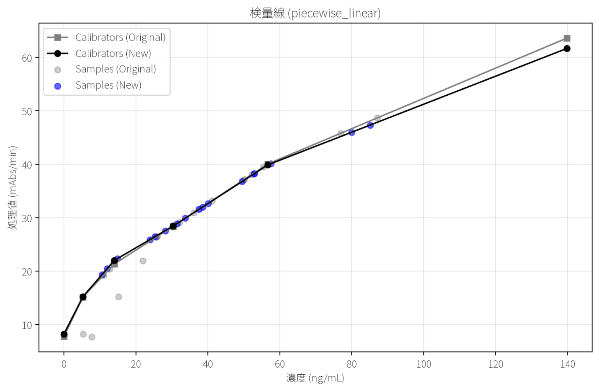

【タイムコース解析モード】
背景：
開発中の検査試薬は、検体と反応することで凝集する。分析装置はその濁度変化を吸光度(Abs)としてとらえることで、検体中の特定物質の濃度を算出します。
吸光度変化を捉えるため、取得したタイムコースデータのうち、どのポイント(何秒から何秒まで)の吸光度を計算に使用するかの検討を実施する必要性があります。
分析装置内部での計算は遅く、開始(秒)と終了(秒)の組合せが多いため、開発には時間を要する課題もあります。

目的：
①検討している試薬処方によって、どの期間の吸光度変化を用いるのが良いかのデータ検証を簡便化させること。
②個別の検体に注目した際、様々な処方の試薬間での吸光度波形の差を視覚的に捉えやすくすること。

※以下、測定項目「TAT」を例にした検体測定手順です。
TATの仮パラメーター
・キャリブレーターのポイント数：6
・キャリブレーター採用値：n=1測定の値(他にも、n=3測定平均値や、n=3測定中央値などの採用候補があります)
・キャリブレーター濃度：(Cal1濃度, Cal2, Cal3, Cal4, Cal5, Cal6) = (0.0, 5.3, 14.0, 30.4, 56.7, 139.8) ←後々「415RDX」のように任意のロット名を付けてjsonなどで呼び出し可能にしたいです。
・検量線モード：折れ線(他には、スプラインや直線などがあります)
・測光ポイント(デフォルト)：10から20ポイント目(10ポイント目の時刻(秒)をt_10,その時の吸光度(x10mAbs.)をA_10、20ポイント目の時刻をt_20、その時の吸光度をA_20とします。)

「処理値（mAbs/min.）」={(A_20-A_10)*0.1}/{(t_20-t_10)/60}　処理値はこのように求められます。
例えば、{"依頼No.":"C001","項目名":"TAT207","項目No.":37,"測光ﾎﾟｰﾄ":19,"処理値":2.3,"時間":0,"吸光度":11077} #(参照：data\parsed-data\260708 (Calibratin~乖離検体まで) F12 CSV_data\profile.parquet)
この、「"処理値":2.3」は、上記の式の通り、
{(11076-11041)*0.1}/{(171.2-81.2)/60}=2.333… =2.3
と、求めることができます。

この様に、Cal1(x, y)=(0.0, 2.3)が求まります。Cal2~6も同様にして、検量線(濃度既知xと処理値y)を作成します。
続いて一般検体を測定し、処理値yが求め、Cal1~6で作成された関数をxについて解き、x=f(y)で検体測定値を算出します。

できるようになりたいこと：
現状の生データcsvファイルでは、上記の算出方法により測定された値が、「data\parsed-data\260708 (Calibratin~乖離検体まで) F12 CSV_data\measurement.parquet」に、算出の元となった値は「data\parsed-data\260708 (Calibratin~乖離検体まで) F12 CSV_data\profile.parquet」に保存されています。
まずは、目的①の解決を目指します。
試薬パラメーターの至適条件を決定するため、測光ポイント(測光開始(秒)と終了(秒))の全組合せでキャリブレーターの処理値を求め、これを使用して検量線を作成します。そのキャリブレーションデータを用いたと仮定して、変更後の測光ポイントで一般検体の処理値も算出し、検体測定値まで求めます。その上で、別の測光ポイントを選択した際との吸光度および測定値がどのように変化するかの比較を行いたいです。
・縦軸が「処理値 (mAbs/min)」、横軸が「濃度」となるようにしてください。
・横軸の「濃度」は、「濃度 (ng/mL)」のように、単位を付けてほしいです。単位の情報は、「data\parsed-data\260708 (Calibratin~乖離検体まで) F12 CSV_data\metadata.json」に項目(TAT1など)別に保存されています。これを参照することで将来的に試薬項目が変更になっても動的に対応できるようにしてください。
・キャリブレーターのプロット図は、測光ポイント変更前後のものを、同一のグラフ内で表示して、視覚的にどの検体がどう動いたかが分かりやすいように変更したいです。「Calibrators (New)」、「Samples (New)」、「Calibrators (Original)」、「Samples (Original)」を表示できるようにお願いします。

-----------------------------------
上記のプロンプトをJulesに渡した結果、現在のmain.pyへの修正をしてくれました。
非常に良くコーディングしてくれていますが、現在のコードに、以下の課題が残っています。その修正をお願いします。

①ユーザーがキャリブレーターの依頼No.を手入力する必要があり、生データの確認とアプリ画面での入力が煩雑。
実際には、例えば「data\parsed-data\260708 (Calibratin~乖離検体まで) F12 CSV_data\measurement.parquet」のTAT2のキャリブレーション測定の列を探すと、C013~C015に、不完全なデータ(本来、TATのCalは6ポイントなのに、ここでは測定失敗により3ポイントしかない)、C157~C162に完全データ(失敗したのでやり直した結果)が入っています。
一般検体(依頼No.が数字のみで構成されている測定)は測定値(ng/mL)の結果が保存されていますが、キャリブレーター(依頼No.がC+数字)の結果は、単位がmAbs/minで保存されています。また、必ずキャリブレーション結果は連続したデータになっています。このため、少なくとも「依頼No.」と「TAT2」から、キャリブレーターの感度データはプログラミングによる取得が可能です。今回の例では、不完全データと完全データが混在していますが、候補をリスト化して、ドロップダウンでアプリ画面上で選択可能にすれば、生データなどを確認して、C157のような依頼No.を探して、アプリ画面に手入力するよりもはるかに簡単になります。

②タイムコース変更後のキャリブレーションから算出される測定値に誤りがある可能性
「」と、「AI-chat\Antigravity\2026-07-30T10-32_export.csv」を参照してください。これは、解析対象「260708 (Calibratin~乖離検体まで) F12 CSV_data」で、解析項目「TAT2」で、キャリブレーターID「C157, C158, C159, C160, C161, C162」、デフォルト測光ポイント (Base)「開始時間 (Base)81.2s、終了時間 (Base)171.2s」、変更後測光ポイント (New)「開始時間 (New)126.0s、終了時間 (New)180.0s」で解析した結果です。
測定値は、キャリブレーションを基に計算されるはずなので、キャリブレーションの外側に検体のプロットがあるのはどう考えても変です。キャリブレーションが変な線を引いていて、その結果測定値も変なポイントに打たれているなら、計算ミスではなく、キャリブの引き方に問題がありますが、今回の例では、計算の方に問題が生じている可能性があります。この原因究明を行い、対策を考えてほしいです。

これらの実装を行ってほしいです。まずは上記機能を実装する計画化を行ってください。事前に考えられる障害などがあれば、懸念点も示してください。質問があれば、実装前にクリアにしてから実装に移ってください。

-----------------------------------
次に、目的②の解決を目指します。